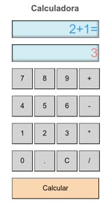

# Calculator

 
 

> Calculator JS

A simple calculator made with HTML, CSS and JS.

## Features

Simple calculator with basic operations.
* Hystory of operations
* Reuse last result to continue operations
* 12 digits
* 4 operations

## Contributing

"If you'd like to contribute, please fork the repository and use a feature
branch. Pull requests are warmly welcome."

## Links

- Project homepage: https://github.com/phcrepaldi/JS_Calculator
- Issue tracker:
  - In case of sensitive bugs like security vulnerabilities, please contact
    phcrepaldi@gmail.com directly instead of using issue tracker. We value your effort to improve the security and privacy of this project!

## Licensing

"The code in this project is licensed under MIT license."